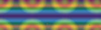
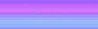

# ML-Captcha
The purpose of this project is to solve captchas. Simple as that.

## Image preprocessing 
Here are some captcha examples I'll try to solve.

This is a real world problem and you see that these captchas seem to be pretty robust

#### Background removal
Images seem to have only 4 backgrounds.

We can extract background from image by using median pixel value of different pictures with same background.
I'll use ImageMagick tool `convert` for this task

`convert 1.png 2.png 3.png -evaluate-sequence median result.jpg`

After getting more images and grouping them by background we can finally extract backgrounds.

They seem to have some dead pixels, but its ok.

Lets see what happens if we compute bitwise `xor` between captcha and backgrounds.

Here is the captcha: 

And `Xor` output of above captcha with all backgrounds:

`Xor` with matching background produces image with removed dark background.

Dark pixels have lower numerical values than coloured ones so we select image with lowest `sum` of numerical pixel values.

With this rather simple step we accomplish background recognition and removal

Next we convert image to black and white only.

## To be continued...

